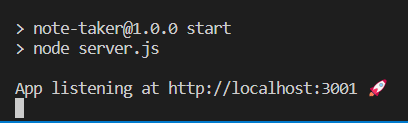
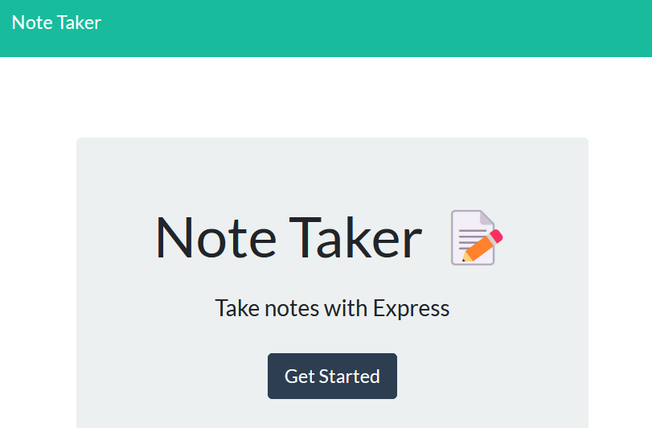
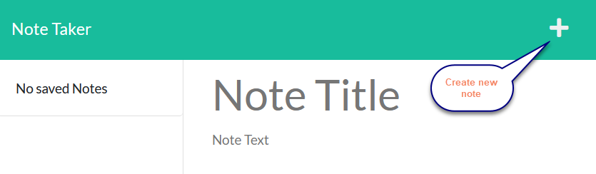
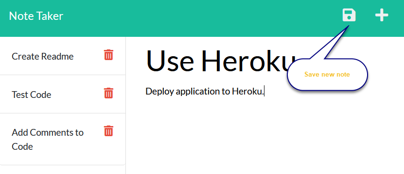
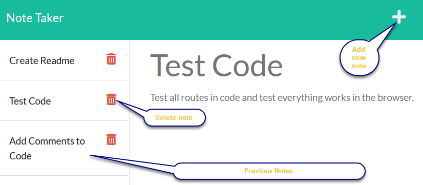

  # [](https://opensource.org/licenses/MIT)

  # Note Taker.

  ## Table of Contents
 - [Description](#description)
 - [Installation](#installation)
 - [Usage](#usage)
 - [License](#license)
 - [Test Instructions](#test-instructions)
 - [Credits](#credits)
 - [Questions](#questions)
  
  ## Description
  This is an application which allows the user enter notes and save them. All saved notes are displayed on the left hand side of the screen. If a saved note is clicked it will open on the right hand side. Notes can be deleted from the left hand side by clicking on the delete icon.
  
  This is a node.js application which uses express to build the API to interact with the "notes" which are stored in a json file. The API provides endpoints to list all "notes", add a "note" and to delete a "note". The API also displays static HTML pages. The API is built in a modular way to allow it to be easily extended and new functionality/endpoints to be added.
  
  The application is developed using the following technologies:
  - javascript
  - node.js
  - express
  - CSS
  - HTML

  The main challenge in developing this application was familiarisation with express and creating routes, as well as linking the frontend to the backend.


  ## Installation
  Ensure node is installed. Test by running 
  ```
  node -v
  ```

  To install this package run:
  ```
  npm install
  ```

  ## Usage
  To run this application enter ensure you are in the main note-taker directory. To start the server run:
```
npm start
```
You should see the message below in your terminal:



Depending on what operating system you are using you may be able to click on http://localhost:3001 or ctrl + click on the link. Otherwise copy the link and paste it in your browser. You should see the initial landing page (static index.html).



Click the "Get Started" button to take you to the page where you can enter notes. Click the "+" icon to add a new note and the "save" icon to save it. 



The save icon only appears after you have entered text.



Previous notes are displayed on the left hand side and clicking on one will open it in the right hand side of the screen. Click the "bin" icon to delete a note.




  ## License
  This project is covered by the "The MIT License" license.
  For more details click on the link below:
  [License](https://opensource.org/licenses/MIT)
  
  
  ## Test Instructions
  There are no specific tests for this application, just test by adding and deleting notes.

  ## Credits
  I would like to thank the instructors at UWA Bootcamp. 
  
  ## Questions
 If you have any questions or feedback please contact me. My details are below. As this is a learning challenge for me I would appreciate any feedback, or ideas for improvement.

 Github : https://github.com/HelenELee 

 Email : helenelee3@outlook.com
  